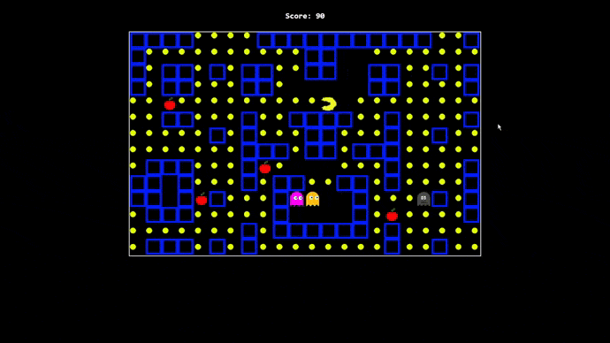

# Pacman using JS     

Pacman game using vanilla JavaScript, HTML, and CSS

## Features 

- [x] Controlpac-man movement with arrow keys
- [x] Ghosts moves randomly to catch the pac-man
- [x] Pac-man ovjective is to collect all the dots in the maze 
- [x] Pac-man can eat fruit and chase down the ghosts and kill it , but ghosts gets respawned.
- [x] Collision Detection
- [x] Score tracking
